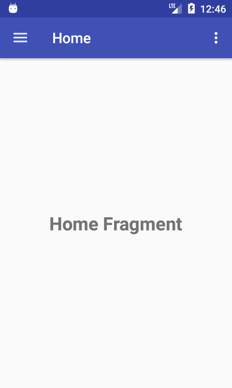
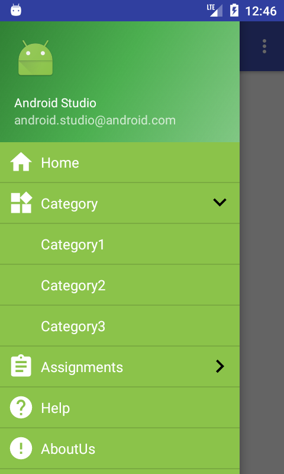
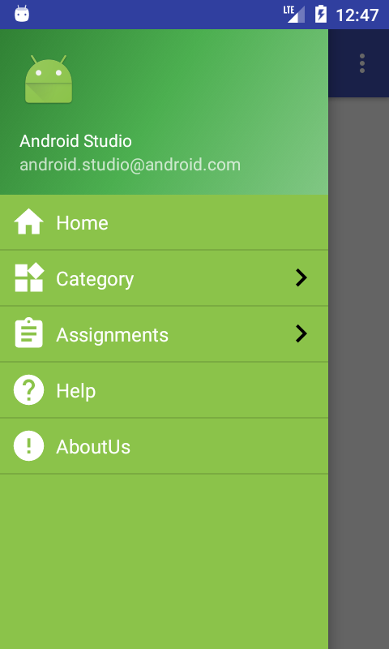

# ExpandableNavigationDrawer

This is android Example to show expandable navigationdrawer
To get a Git project into your build:

clone project and run.

ScreenShot
----

License
----

MIT

**Free Software**

